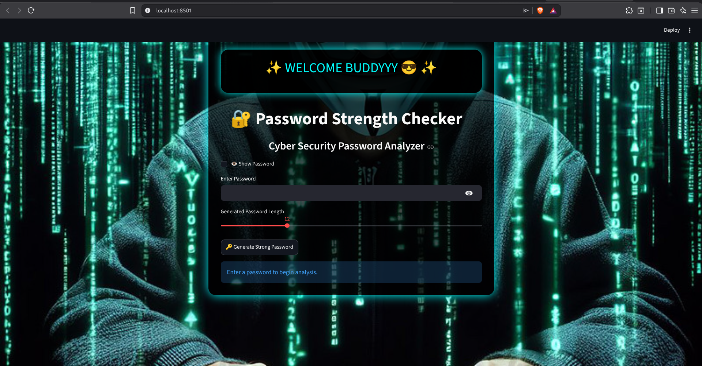

# Password Strength Checker 🔐

A simple Password Strength Checker built using Python and Streamlit.

## Features

- Check password strength
- Real-time feedback
- User-friendly interface

## Tech Stack

- Python
- Streamlit

## Installation

```bash
git clone https://github.com/Dipanshusharma-cyb/password-strength-checker.git
cd password-strength-checker
pip install -r requirements.txt
streamlit run app.py
```

## Screenshots

### Home Page



## Author

Dipanshu Sharma
